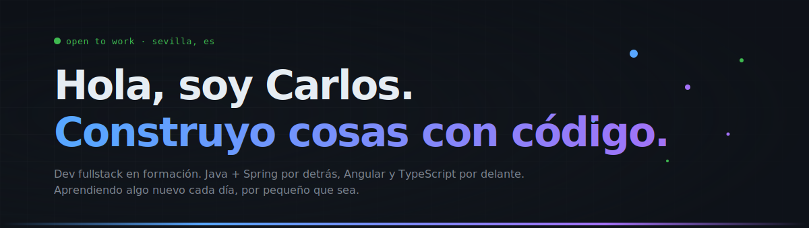

<!--
═══════════════════════════════════════════════════════════════════
  README — V1 MINIMALISTA (personalizado para carlos38sm)
  Ya está todo sustituido. Solo COPIA y PEGA en tu README.md.
  El banner espera estar en la RAÍZ del repo (no en assets/).
═══════════════════════════════════════════════════════════════════
-->

---

### 👋 Sobre mí

Soy **Carlos Sánchez**, desarrollador **fullstack en formación**. Vengo de DAW y estoy completando mi TFG (**Musarum**) — un gestor para músicos hecho con Spring Boot + Angular + MariaDB, todo dockerizado.

Hablo español nativo, inglés B1, y estoy abierto a oportunidades junior donde se aprenda en serio. Me importa más entender **por qué** funciona algo que copiarlo.

---

### 🛠️ Stack

**Backend**  

**Frontend**  

**Plataforma & herramientas**  

---

### 📌 Proyectos destacados

<table>
<tr>
<td width="50%" valign="top">

#### 🎼 [Musarum](https://github.com/carlos38sm/musarum)
> **TFG** · gestor para músicos: agenda de ensayos, repertorio compartido, control de asistencia.

`Spring Boot` · `Angular` · `MariaDB` · `Docker`

</td>
<td width="50%" valign="top">

#### 🧩 [api-rest-template](https://github.com/carlos38sm/api-rest-template)
> Plantilla Spring Boot con JWT, Swagger y Flyway. La que uso para arrancar cualquier proyecto nuevo.

`Java` · `Spring` · `JWT` · `OpenAPI`

</td>
</tr>
</table>

> Cambia los nombres/enlaces de proyectos por los tuyos reales cuando los tengas en GitHub.

---

### 📊 Estadísticas

<picture>
  <source media="(prefers-color-scheme: dark)" srcset="https://github-readme-stats.vercel.app/api?username=carlos38sm&show_icons=true&hide_border=true&bg_color=0d1117&title_color=58a6ff&text_color=e6edf3&icon_color=58a6ff&include_all_commits=true&count_private=true"/>
  
</picture>

<picture>
  <source media="(prefers-color-scheme: dark)" srcset="https://github-readme-stats.vercel.app/api/top-langs/?username=carlos38sm&layout=compact&hide_border=true&bg_color=0d1117&title_color=58a6ff&text_color=e6edf3&langs_count=8"/>
  
</picture>

<picture>
  <source media="(prefers-color-scheme: dark)" srcset="https://streak-stats.demolab.com?user=carlos38sm&theme=dark&hide_border=true&background=0d1117&ring=58a6ff&fire=a371f7&currStreakLabel=58a6ff&dates=7d8590&stroke=21262d"/>
  
</picture>

---

### 🏆 Trofeos

<picture>
  <source media="(prefers-color-scheme: dark)" srcset="https://github-profile-trophy.vercel.app/?username=carlos38sm&theme=onedark&no-frame=true&no-bg=true&column=6&margin-w=10&margin-h=10"/>
  
</picture>

---

### 📚 Aprendiendo ahora — 2026

| Tema | Progreso |
|---|---|
| Testing en Spring (JUnit + Mockito) | `███████░░░` 70% |
| RxJS y signals en Angular | `█████░░░░░` 55% |
| AWS + GitHub Actions (CI/CD) | `███░░░░░░░` 30% |
| Inglés técnico hablado (B2) | `████░░░░░░` 40% |

---

### 💬 Frase favorita

> *"Avanza un poco cada día. Lo pequeño constante le gana a lo grande esporádico."*

---

### 📬 Contacto

 

  Hecho con ❤️ desde Sevilla

